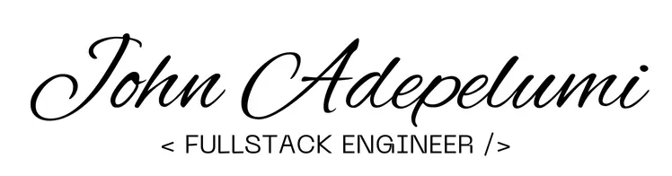

<h1 align="center">Hi there  I'm John</h1>

<h3 align="center" >Results-driven Software Engineer with expertise in JavaScript, TypeScript, React, Node.js, and AWS. Contributed to the actualization of a $2.8M grant at Evon Medics LLC by automating data recovery and restoring over 6,000 critical data points, while re-engineering authentication workflows to enhance scalability for clinical trials. At Broadshift Technologies, I developed a shift management system that optimized staff scheduling and reduced operational costs by minimizing reliance on third-party services.</h3>

- 🔭 I'm currently working at Evon Medics LLC, a medical equipment research and development company based in Maryland, USA.
- 🌱 Alongside my daily job, I’m working to improve my Backend skills while keeping my frontend skills up-to-date. I also spend some of my free time learning Java.
- 👯 I'm looking to collaborate with companies, individuals and agencies on projects to improve users experience on the internet, provide solutions to  real life problems and everyday challenges.

<!--
**Johndiddles/johndiddles** is a ✨ _special_ ✨ repository because its `README.md` (this file) appears on your GitHub profile.

Here are some ideas to get you started:

- 🔭 I’m currently working on ...
- 🌱 I’m currently learning ...
- 👯 I’m looking to collaborate on ...
- 🤔 I’m looking for help with ...
- 💬 Ask me about ...
- 📫 How to reach me: ...
- 😄 Pronouns: ...
- ⚡ Fun fact: ...
-->
