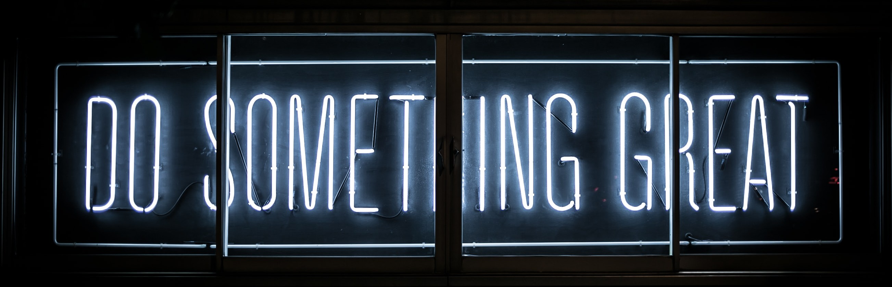

<h1 align="center">Hi there  I'm John</h1>

<h3 align="center" >A frontend developer dedicated to implementing pixel perfect user friendly and interactive designs, without compromising quality and responsiveness</h3>

- 🔭 I'm currently working on a number of projects including Zuri Chat (a messaging software with lots of features to make remote work seamless for organizations).
- 🌱 I’m currently learning Node.Js for backend while improving my ReactJs, HTML5 and CSS3 skills.
- 👯 I'm looking to collaborate with companies, individuals and agencies on projects to improve users experience on the internet, provide solutions to  real life problems and everyday challenges.

<!--
**Johndiddles/johndiddles** is a ✨ _special_ ✨ repository because its `README.md` (this file) appears on your GitHub profile.

Here are some ideas to get you started:

- 🔭 I’m currently working on ...
- 🌱 I’m currently learning ...
- 👯 I’m looking to collaborate on ...
- 🤔 I’m looking for help with ...
- 💬 Ask me about ...
- 📫 How to reach me: ...
- 😄 Pronouns: ...
- ⚡ Fun fact: ...
-->
